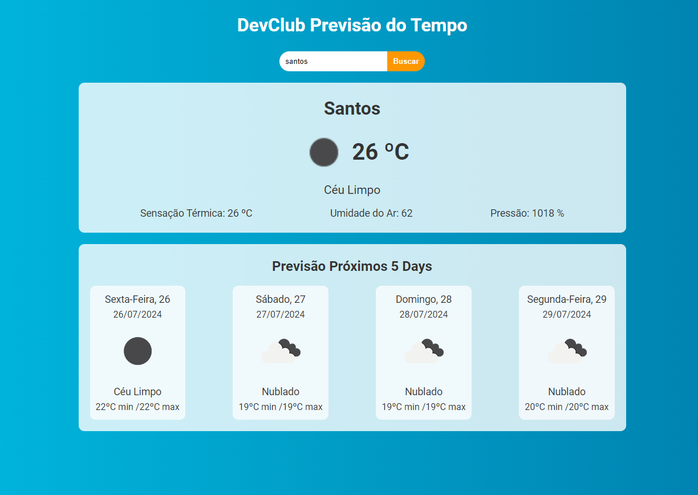

## Projeto de Estudo em React
Projeto de prvisão do tempo com React, utilizando as api's da [OpenWheather](https://openweathermap.org/api), para buscar a previsão do tempo de uma cidade qualquer.

Link da Aula no Youtube. [Link](https://www.youtube.com/watch?v=1mm_C-t_Vyg&t=1176s)